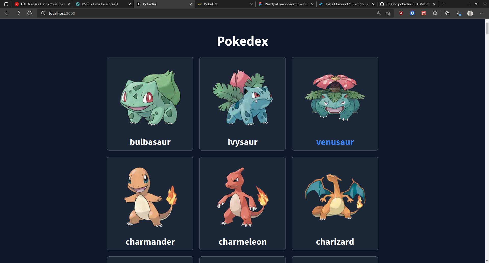

# Pokedex

Simple Pokemon description with NextJS and TailwindCSS. API from [PokeAPI](https://pokeapi.co/)

## Run this in your local machine

1. Clone this repo 
2. And type `cd pokedex && yarn install && yarn run dev` in your terminal

